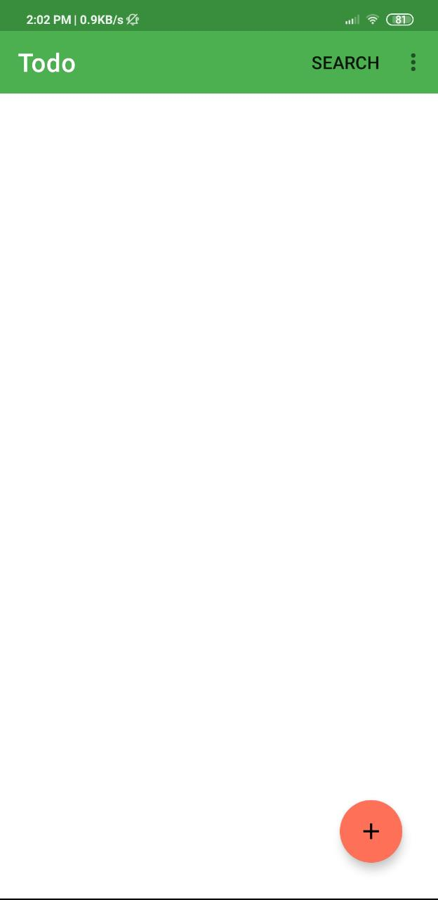
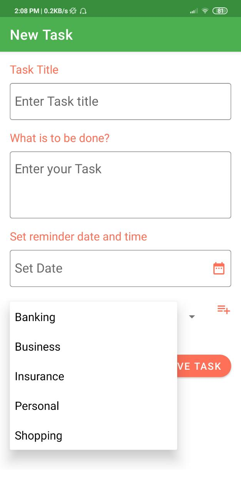
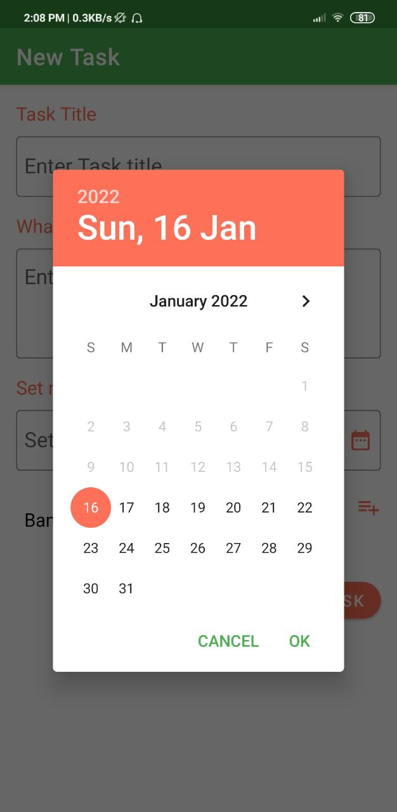
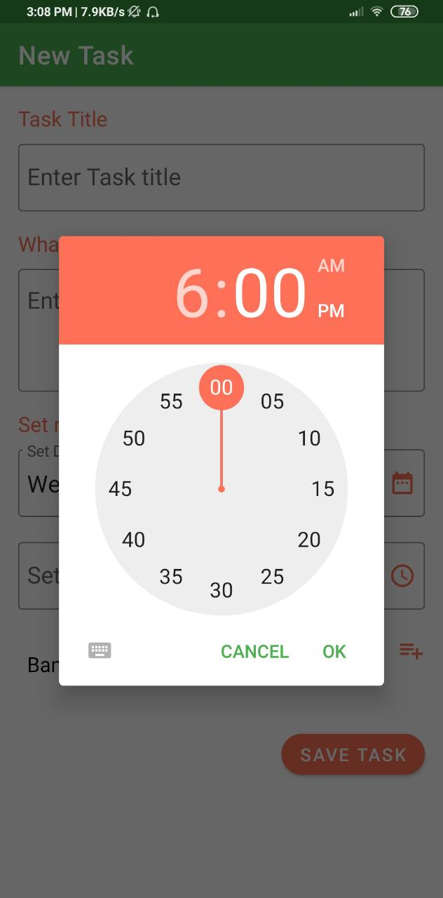
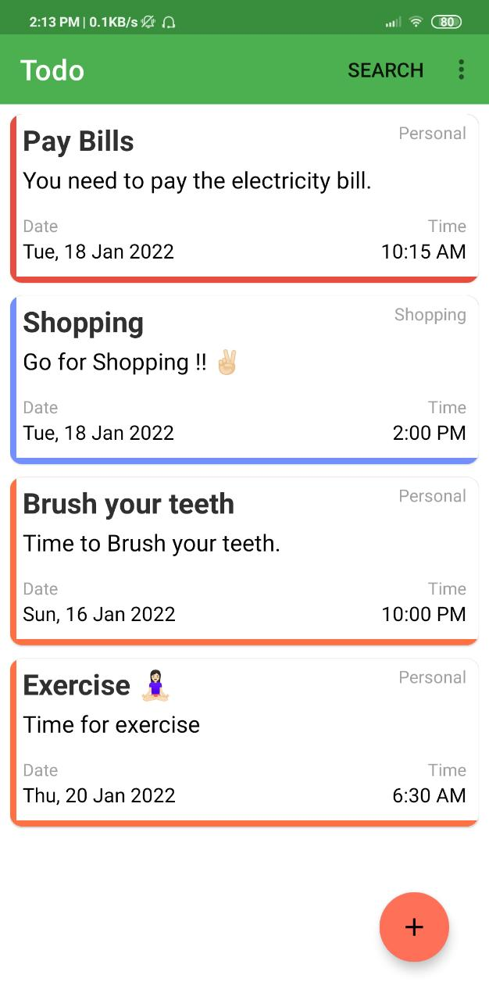
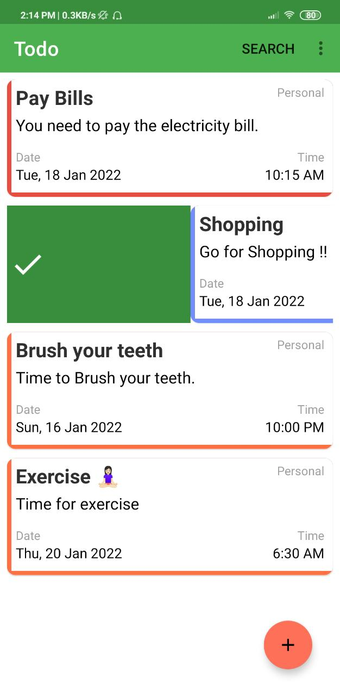
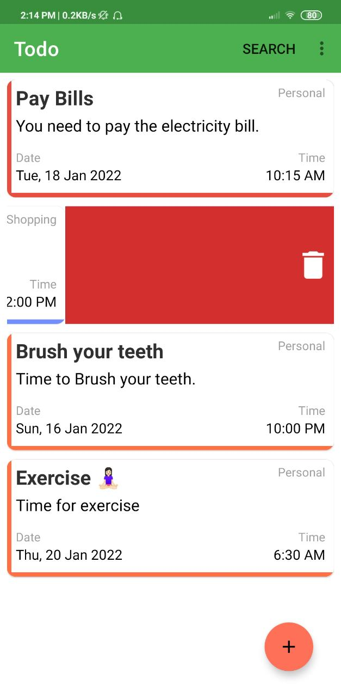
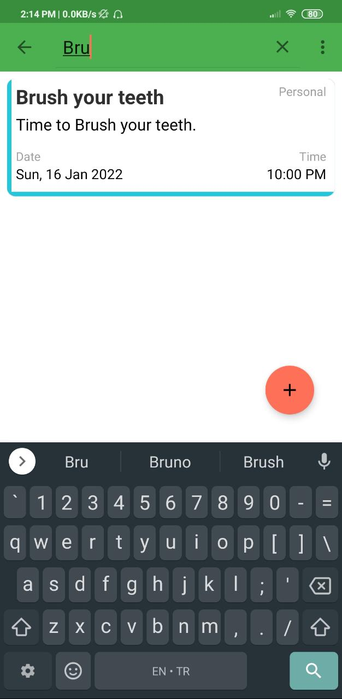

## 🌟 About
App To-do list đơn giản hỗ trợ người dùng trong trong công việc hằng ngày. Được xây dựng bằng Kotlin, app hỗ trợ thêm, sửa, xóa các tác vụ của người dùng giúp họ theo dõi hoạt động hàng ngày của bản thân. 
## ✨ Screenshots

 

### Các công cụ:
*   Android Studio 
*   Java JDK

## Các thư viện được sử dụng:
- [Kotlin](https://kotlinlang.org/) - First class and official programming language for Android development.
- [Coroutines](https://kotlinlang.org/docs/reference/coroutines-overview.html) - For asynchronous and more..
- [Room](https://developer.android.com/topic/libraries/architecture/room) - SQLite object mapping library.
- [RecyclerView](https://developer.android.com/jetpack/androidx/releases/recyclerview) - Display large sets of data in your UI while minimizing memory usage.
- [Material Components for Android](https://github.com/material-components/material-components-android) - Modular and customizable Material Design UI components for Android.
- [ViewBinding](https://developer.android.com/topic/libraries/view-binding) - Generates a binding class for each XML layout file present in that module and allows you to more easily write code that interacts with views.

